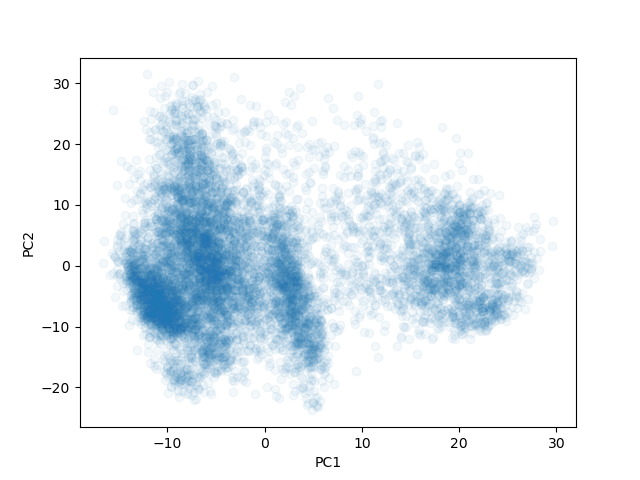

# Access to clustering data

## Data description
Clustering is often applied to single-cell RNA-sequencing data. The provided dataset is a subset of single-cell RNA-sequencing data from a normal human lung. You can explore the full dataset at this link: https://cellxgene.cziscience.com/e/2f132ec9-24b5-422f-9be0-ccef03b4fe28.cxg/.

The provided data was subset to only include the following cell types: "lung ciliated cell", "fibroblast of lung", "club cell", "endothelial cell"

And to only include genes with expression levels > 1000 across all cells.

## Downloading the data
To download this data, run the following commands:

```
wget https://raw.githubusercontent.com/juliaolivieri/COMP_293C_Computational_Biology/main/project/clustering/gene_expression.csv.gz
wget https://raw.githubusercontent.com/juliaolivieri/COMP_293C_Computational_Biology/main/project/clustering/cell_types.txt
wget https://raw.githubusercontent.com/juliaolivieri/COMP_293C_Computational_Biology/main/project/clustering/gene_names.txt
gunzip *.gz
```

## Data format
The provided data includes a matrix of comma-separated values in the file `gene_expression.csv`. Rows correspond to different cells, and columns correspond to different genes. Gene names (in order) are available in `gene_names.txt`. Cell type labels for each cell are available in `cell_types.txt`. You can use these labels to check how your clustering matches up with the labeled cell types if you would like.

## Plotting

It is not intuitive how to visualize points in many dimensions. Often, "dimensionality reduction" techniques are used to reduce the data to two dimensions, so it can be visualized more easily. PCA is a common dimensionality reduction approach for these purposes.

Here is example Python code to plot the data using PCA. You may find it useful to modify this code to color each point by the cluster your algorithm assigns it, as a way to "visually inspect" the clustering.

```
import matplotlib.pyplot as plt
import pandas as pd
from sklearn.decomposition import PCA

# read in data 
df = pd.read_csv("gene_expression.csv", header = None)

# Use PCA to reduce to 2 dimensions
pca = PCA(n_components=2)
pca_features = pca.fit_transform(df.values)
pca_df = pd.DataFrame(
    data=pca_features, 
    columns=['PC1', 'PC2'])

# plot data
plt.plot(pca_df["PC1"], pca_df["PC2"], marker="o", linestyle="", alpha = 0.05)
plt.xlabel("PC1")
plt.ylabel("PC2")
plt.savefig("clustering.png")
plt.show()
```

The result of this code is:



