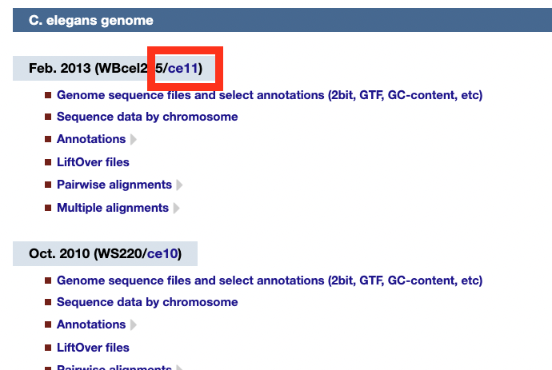
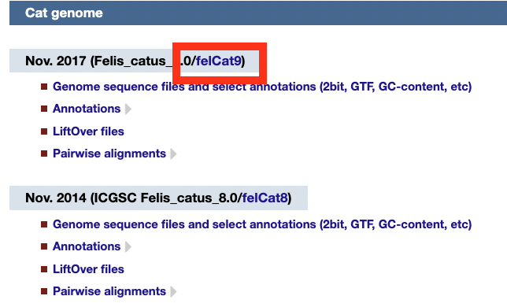

# How to download genome and gtf files

1. Explore the genomes on this webpage, and decide which one you want to download.
1. Find the name of the genome. For human, you can use `hg38`. Otherwise, this will be the blue text in the gray box with the date. For example, for *C. elegans* the name is `ce11`. For cat, the name is `felCat9`.
   
   
1.  
